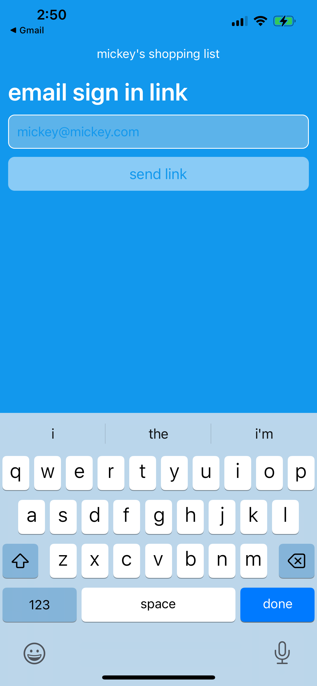
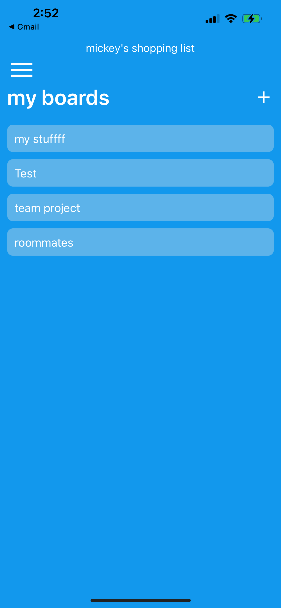
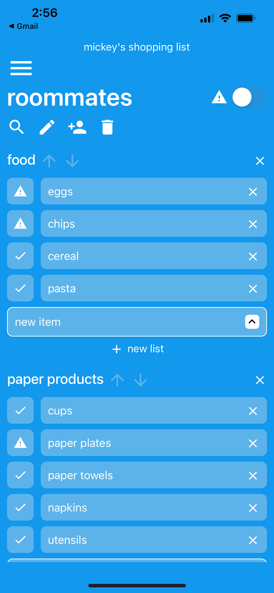
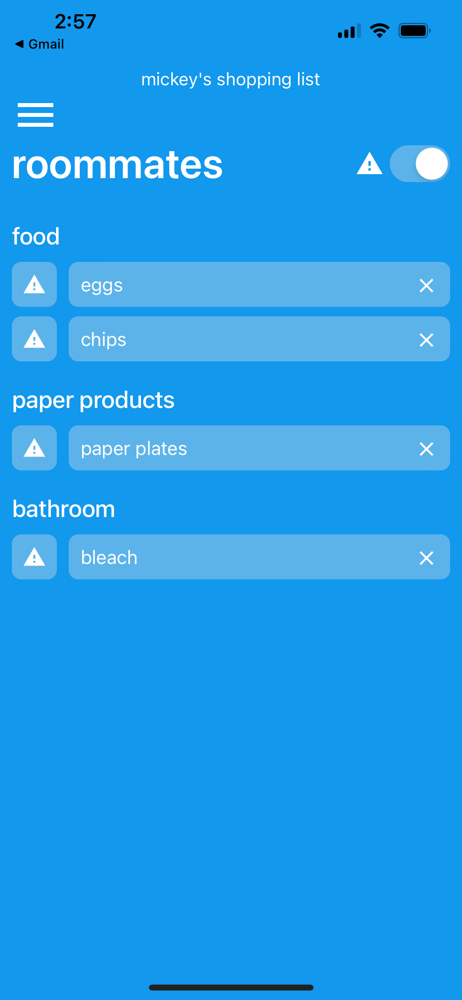
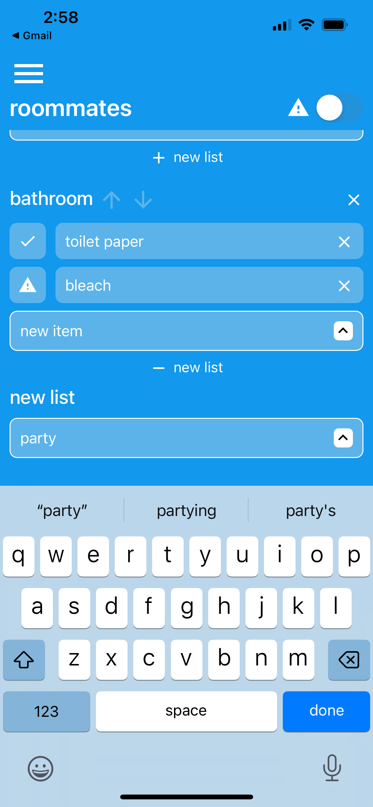
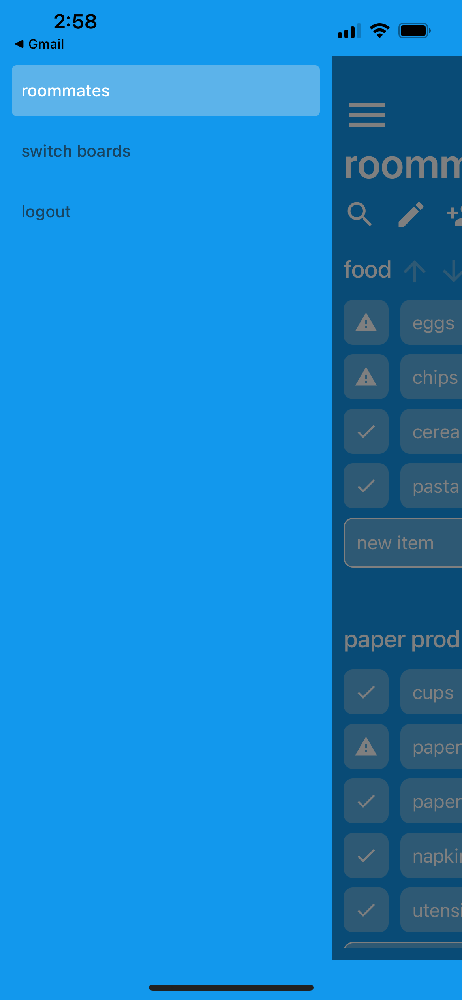
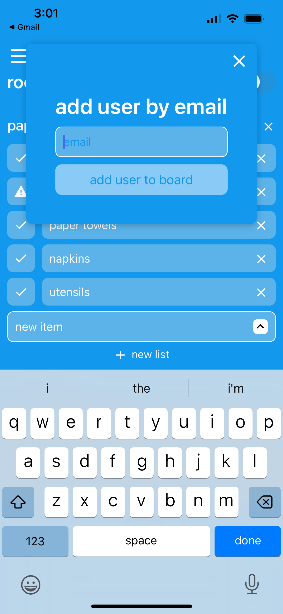

# Mickey's Shopping List App

### IOS App that allows you to maintain and organize inventories (ie your usual grocery items) and mark when items are low so you can easily view what you need to buy on the go... and share/maintain your lists with others (ie roommates) in real time

## Tools
- React Native Expo
- Firebase (email sign in, realtime database, crashlytics)
- EAS build

## Screenshots

